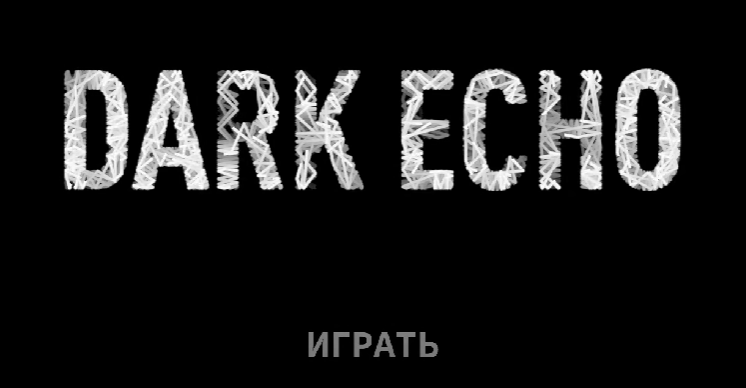
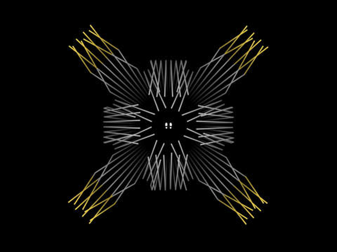
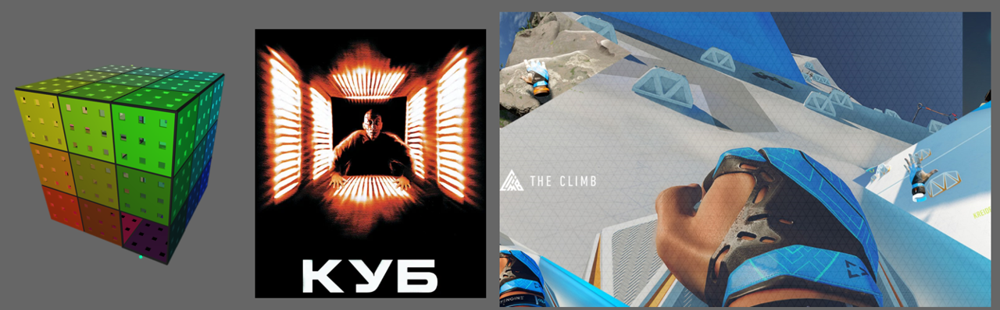
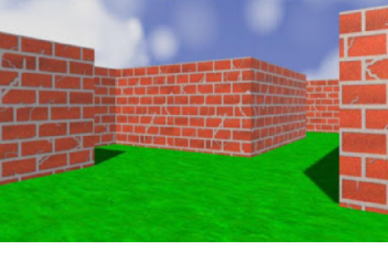
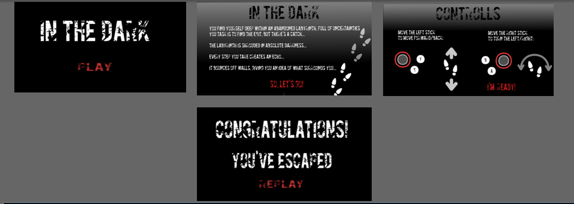
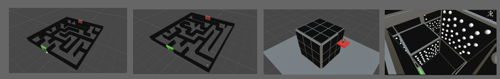
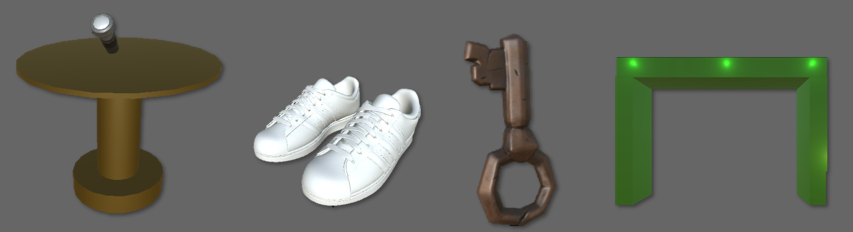
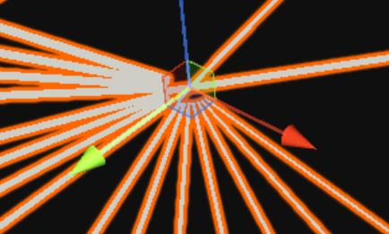

<h1>In The Dark</h1>

Walking through the maze

<ul>
  <li>Android/Oculus Quest 2</li>
  <li>Landscape orientation</li>
</ul>

<h2>Concept:</h2>

The project is a labyrinth-walker in the style of «Dark Echo», using Virtual Reality (VR) technology. 

The player needs to get out of the abandoned labyrinth, but the difficulty is that the labyrinth is pitch dark and absolutely nothing can be seen.

Controlling the main character, you need to get to the exit of the labyrinth. The echo of the player's footsteps, which is visualized by rays spreading in different directions and reflecting off obstacles, will help you get out of the impenetrable labyrinth.

At one of the levels, you need to go through a labyrinth using the mechanics of climbing walls, grabbing onto ledges in the wall. You need to collect all the bonuses in this labyrinth and find the exit that appears from the labyrinth.

Upon reaching the finish line, the player completes the maze level and wins.

<h2>Reference and visual style:</h2>

The following serve as references::
  <li>a game project on a similar topic that has the necessary game mechanics: </li>

<href>https://store.steampowered.com/app/368650/Dark_Echo/</href>

<figure>
   
   <figcaption>Picture 1 - UI reference (Dark Echo)</figcaption>
  </figure>

<figure>
   
   <figcaption>Picture 2 - Reference Level Design (Dark Echo)</figcaption>
  </figure>

<li> browser game project "3D Maze", which inspired the implementation of one of the game project levels: </li>

<href>https://www.chrisraff.com/3d-maze/</href>
<li> game project "THE CLIMB", which inspired the implementation of the mechanics of one of the levels of the game project: </li>

<href>https://www.theclimbgame.com/</href>
<li> the science fiction film "Cube", which inspired the implementation of one of the levels of the game project: </li>

<href>https://www.kinopoisk.ru/film/20590/?utm_referrer=www.google.com</href>

<figure>
   
   <figcaption>Picture 3 - References for one of the levels of the VR game project</figcaption>
  </figure>

 

However, the current implementation of the project involves 3D visualization:

<ul>
  <li>Start and finish, bonuses, and also the level of the labyrinth.</li>
  <li>The camera is first person and moves with the player.</li>

<figure>
   
   <figcaption> Picture 4 - Example of camera location </figcaption>
  </figure>

  

The UI is relatively minimalistic, similar to the original, but with buttons.

<figure>
   
   <figcaption>Picture 5 - UI of a VR game project</figcaption>
  </figure>

The visual style of the levels matches the style of Dark Echo: the design of the labyrinth, the recognizable model of sound propagation.

<figure>
   
   <figcaption>Picture 6 - 3D models of labyrinth levels of the VR game project</figcaption>
  </figure>

<figure>
   
   <figcaption>Picture 7 - 3D models of additional objects of the VR game project</figcaption>
  </figure>

<figure>
   
   <figcaption>Picture 8 - An example of the implementation of the mechanics of the propagation of "rays of sound waves/echo"</figcaption>
  </figure>

<h2>Life cycle:</h2>
  <li>1. 
Launch/start the game by pressing the "PLAY" button in the start menu.</li>
  <li>2. Screen with plot/backstory, control description and button to go to the next screen.</li>
  <li>3. Screen with description of controls and button to go to level 1 with a labyrinth.</li>
  <li>4. Passing the labyrinth from the START point to the FINISH point and moving to the 2nd level.</li>
  <li>5. Passing the labyrinth from the START point to the FINISH point and collecting bonuses, as well as moving to level 3.</li>
  <li>6. Passing the labyrinth from the START platform to the FINISH platform and collecting bonuses.</li>
  <li>7. The player wins by successfully reaching the "FINISH" platform. The "CONGRATULATIONS!" screen is activated, offering to play the game again by pressing the "REPLAY" button. The transition to point 1 occurs.
</li>

<h2>Mechanics and features:</h2>
<h3><u>Core mechanics:</u></h3>
<ul>
  <li>The player moves using the left controller..</li>
  <li>The player turns using the right controller.
</li>
  <li>The player moves through the maze without passing through its walls.
</li>
  <li>As the player moves, the sounds of his footsteps can be heard.
</li>
  <li>At the moment when the player takes a step, during movement, rays are emitted from the place of the sound of his step, emulating the propagation of sound (sound waves) from the step.
</li>
  <li>Reflection of sound rays from obstacles and their gradual disappearance.
</li>
    </ul>

<h3><u>Additional-mechanics:</u></h3>
<ul>
  <li>The player collects bonuses in the form of pairs of shoes to complete the level.
</li>
  <li>Upon reaching the finish line, the player is transferred to the next level.

  <li><ul>
    <li>Level 1 – "simple" passage of the labyrinth.
</li>
    <li>Level 2 – to pass this level, you need to collect all the bonuses in the form of pairs of shoes.
</li>
 </ul>   
    </ul>

<h3><u>Juice mechanics:</u></h3>

  <li>The player cannot complete the level until he collects all the bonuses.
</li>
<ul>
  <li>Adding objects that can be moved around the maze.
</li>
  <li>Adding a new level that features mechanics of moving objects to solve puzzles and complete levels.
</li>
</ul>

<li>Adding a new level that features mechanics of moving objects to solve puzzles and complete levels.
</li>

<h2>Build:</h2>

The project build can be downloaded from the following link:

<href>https://drive.google.com/file/d/1uy4d0F7j4_yyQJ933fYWsN_HIzMx4mUK/view?usp=sharing</href>
<h2>Demonstration video:</h2>
<href>https://youtu.be/qUt66oXlr00</href>
<h2>Launch instructions (Oculus Quest 2):</h2>

1. Download the build (.apk file) of the project from the link.

2. Install SideQuest (or any other program that allows you to view VR hardware directory files) on your PC, which allows you to download third-party installation files to Oculus.

3. Using SideQuest, install the build installation file (.apk) into oculus quest 2.

4. After installing the application, you need to go to the VR headset settings in the applications tab and select "Unknown applications".

5. Among unknown applications, find the application named "MAI_VR_Project_DE" and run it.

