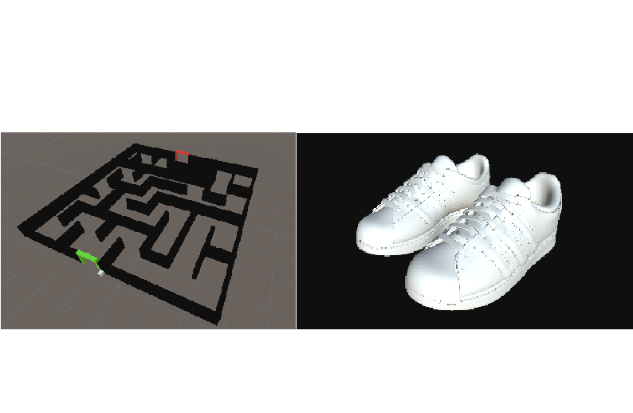

<h1>In The Dark</h1>

Прохождение лабиринта

<ul>
  <li>Android/Oculus Quest 2</li>
  <li>Альбомная ориентация</li>
</ul>

<h2>Концепция:</h2>

Проект представляет из себя лабиринт-бродилку в стилистике «Dark Echo», с применением технологии Virtual Reality (VR). 

Игроку необходимо выбраться из заброшенного лабиринта, но сложность заключается в том, что в лабиринте кромешная тьма и абсолютно ничего не видно.

Управляя главным героем, необходимо добраться до выхода из лабиринта. Выбраться из непроглядного лабиринта поможет эхо от звука шагов игрока, которое визуализировано лучами, распространяющимися в разные направления и отражающимися от препятствий.

При достижении финиша игрок проходит уровень лабиринта и выигрывает.

<h2>Референс и визуальный стиль:</h2>

В качестве референса выступает игровой проект на аналогичную тематику, имеющий необходимые игровые механики:

<href>https://store.steampowered.com/app/368650/Dark_Echo/</href>

<figure>
   
   <figcaption>Рисунок 1 - UI референса (Dark Echo)</figcaption>
  </figure>

<figure>
   
   <figcaption>Рисунок 2 - Дизайн уровней референса (Dark Echo)</figcaption>
  </figure>

 

Однако текущая реализация проекта предусматривает 3D визуализацию:

<ul>
  <li>Старта и финиша, бонусов, а также уровня лабиринта.</li>
  <li>Камера от первого лица и перемещается вместе с игроком.</li>

<figure>
   
   <figcaption>Рисунок 3 - Пример расположения камеры</figcaption>
  </figure>

  

UI относительно минималистичный, по аналогии с оригиналом, но с наличием кнопок.

Визуальный стиль уровней соответствует стилистике мультипликационного мультфильма: природный ландшафт, узнаваемая модель игрока и соответствующие по стилистике модели врагов, старта и финиша. Стены лабиринта визуально представляют из себя растительность (кусты).

<figure>
   
   <figcaption>Рисунок 4 - 3D модели старта и финиша, бонусов, лабиринта</figcaption>
  </figure>

<h2>Жизненный цикл:</h2>
<ol>
  <li>Запуск/начало игры по нажатию на кнопку «PLAY» в стартовом меню.</li>
  <li>Экран с сюжетом/предысторией, описанием управления и кнопкой с переходом к следующему экрану.</li>
  <li>Экран с описанием управления и кнопкой с переходом к уровню с лабиринтом.</li>
  <li>Прохождение лабиринта от точки «СТАРТ» до точки «ФИНИШ».
</li>
  <li>Игрок выигрывает при успешном достижении точки «ФИНИШ». Включается экран «CONGRATULATIONS!», на котором предлагается еще раз пройти игру заново по нажатию на кнопку «REPLAY». Происходит переход на пункт 1.
</li>
</ol>

<h2>Механики и фичи:</h2>
<h3><u>Core-механики:</u></h3>
<ul>
  <li>Игрок перемещается с помощью левого контроллера.</li>
  <li>Игрок поворачивается с помощью правого контроллера.
</li>
  <li>Игрок перемещается по лабиринту, не проходя сквозь его стены.
</li>
  <li>Во время перемещения игрока слышны звуки его шагов.
</li>
  <li>В момент в момент, когда игрок совершает шаг, во время перемешения, от места звука его шага испускаются лучи, эмулирующие распространение звука (звуковых волн) от шага.
</li>
  <li>Динамический враг патрулирует часть коридоров лабиринта по заданному маршруту.
</li>
  <li>Динамический враг погибает при попадании в него «крика».
</li>
  <li>При нажатии на клавишу Q из игрока вылетает «крик», который при попадании во вражеское существо отнимает у него жизни.
</li>
    </ul>

<h3><u>Additional-механики:</u></h3>
<ul>
  <li>Игрок собирает бонусы в виде табличек и получает за это очки.
</li>
  <li>При достижении финиша игрок переносится на следующий уровень.

  <li><ul>
    <li>1 уровень – все враги статичны и чтобы пройти уровень их необходимо «напугать».
</li>
    <li>2 уровень (стелс) – все враги динамичные и перемещаются по лабиринту, но атаковать их нельзя, а можно только-лишь избегать их в других частях лабиринта.
</li>
    <li>3 уровень – враги статичные и динамичные, которых можно «пугать».
</li>
 </ul>   

  <li>Динамичный враг перемещается не по заданному пути, а между определенными точками в случайном порядке, самостоятельно выбирая кратчайший путь.
</li>
  <li>При нахождении игрока на близком расстоянии динамический враг начинает его преследовать, отклоняясь от своего маршрута.
</li>
  <li>При нахождении игрока на очень близком расстоянии от динамического врага враг начинает его атаковать.
</li>
  <li>Начисление очков за «испуг» вражеского существа.
</li>
    </ul>

<h3><u>Juice-механики:</u></h3>
<ul>
  <li>Игрок не может завершить уровень до тех пор, пока не соберет все бонусы.
</li>
  <li>Перемещение/толкание предметов в лабиринте подобно игре «Sokoban».
</li>
  <li>Добавление предметов, которые можно перемещать по лабиринту.
</li>
  <li>Добавление нового уровня, в котором присутствует механика перемещения предметов.
</li>
</ul>

<h2>Билд:</h2>

Билд проекта можно скачать по следующей ссылке:

<href>https://drive.google.com/drive/folders/1vqVZ-kQntSPhnt7hrg3ffa7bEabEGP9F?usp=sharing</href>
<h2>Инструкция по запуску:</h2>

1. Скачать билд проекта по ссылке.

2. Разархивировать скачанные файлы, если они скачались архивом.

3. Запустить ShrekMaze3D.exe.

